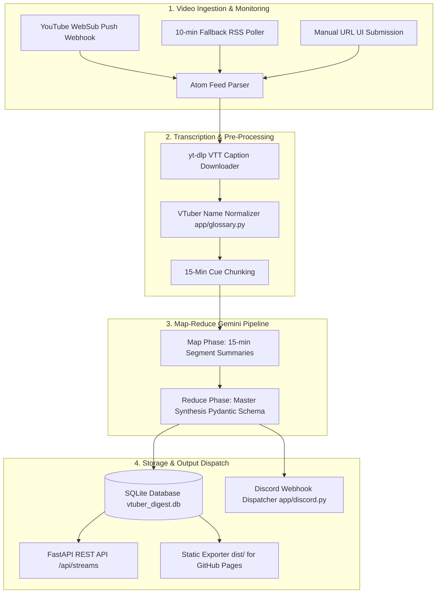

# 🎙️ VTuber Digest (VTuber Larping)

[](https://python.org)
[](https://fastapi.tiangolo.com)
[](https://cloud.google.com/vertex-ai)
[](https://github.com/mting314/vtuber-larping/actions)
[](https://mting314.github.io/vtuber-larping/)

An automated **Map-Reduce LLM Summarization Pipeline** and **Observability Engine** for VTuber chatting streams (*zatsudan*). 

Automatically ingests transcripts from Hololive EN, Hololive ID, VShojo, and indie VTubers, generating standardized executive summaries, exact `[HH:MM:SS]` story timestamps, and rich Discord webhook alerts.

---

## 🌐 Live GitHub Pages Dashboard
👉 **[https://mting314.github.io/vtuber-larping/](https://mting314.github.io/vtuber-larping/)**

---

## 🌟 Key Features

* 📡 **Automated Video Monitoring:** Detects new streams via YouTube WebSub webhooks & 10-minute fallback RSS polling without consuming YouTube API quota.
* 🤖 **Map-Reduce LLM Pipeline:** Uses Google Gemini 2.5 Flash on Vertex AI with Pydantic Schema enforcement for guaranteed structured JSON outputs.
* ⏱️ **Exact Timestamp Pinpointing:** Enforces `[HH:MM:SS]` START timestamps for every story or anecdote, creating clickable YouTube playback links.
* 📖 **VTuber Glossary & Name Normalizer:** Auto-corrects auto-caption phonetic typos (`Crony` → `Kronii`, `Goorah` → `Gura`, `Fuwamoko` → `FUWAMOCO`).
* 🔇 **BGM & Noise Suppression:** Systematically ignores opening stream BGM music, "Stream Starting Soon" screens, and intro screaming.
* 💬 **Discord Webhook Embeds:** Dispatches rich Discord embeds with VTuber agency badges, thumbnails, top highlights, and clickable timestamp tags.
* ⚙️ **User Preference Settings:** REST API endpoints (`GET/PUT /api/settings`) and UI modal (`⚙️ Settings`) for Discord Webhooks and notification controls.
* 🚀 **GitHub Pages Integration:** Automatically builds static JSON API endpoints and deploys the glassmorphic dashboard to GitHub Pages via GitHub Actions.

---

## 🏗️ Architecture Overview



---

## ⚡ Quickstart & Local Setup

### 1. Prerequisites
* Python 3.12+
* [`uv`](https://github.com/astral-sh/uv) fast Python package manager (`pip install uv` or `winget install astral-sh.uv`)
* Google Cloud SDK (`gcloud`) with a GCP Project ID

### 2. Installation & Sync
```bash
# Clone the repository
git clone https://github.com/mting314/vtuber-larping.git
cd vtuber-larping

# Sync dependencies and create virtual environment with uv
uv sync
```

### 3. Environment Configuration
Create a `.env` file in the root directory:
```env
# Google Cloud Platform (GCP) Configuration
GCP_PROJECT=vtuber-digest-503801
GCP_LOCATION=us-central1

# Optional: Google Cloud Storage Bucket
GCS_BUCKET_NAME=vtuber-summaries
```

### 4. Run Local Development Server
```bash
uv run python -m uvicorn app.main:app --host 127.0.0.1 --port 8000
```
Open **`http://127.0.0.1:8000`** in your browser to view the interactive web dashboard!

---

## 🧪 Testing & Verification

Run the unit test suite and lint checks with `uv`:
```bash
# Run Pytest unit tests
uv run pytest tests/

# Run Ruff linting check
uv run ruff check app/ tests/
```

---

## 📚 Documentation Links

* 📐 **[Architecture Overview](docs/architecture.md)** — Detailed pipeline stages, models, and design decisions.
* ⚙️ **[Setup & Deployment Guide](docs/setup.md)** — GCP Vertex AI setup, environment configuration, and GitHub Pages deployment.
* 🔌 **[REST API Reference](docs/api.md)** — Full specification of REST API endpoints.

---

## 📄 License

Distributed under the MIT License. See `LICENSE` for more information.
