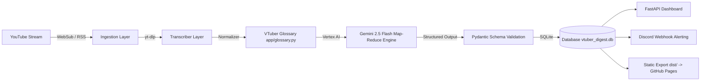

# 📐 Architecture & Engineering Specifications

This document details the software architecture, data pipelines, and design decisions behind **VTuber Digest**.

---

## 🏗️ System Architecture

---

## 🧩 Core Components

### 1. Ingestion Layer (`app/ingestion.py`)
* **YouTube Atom XML Parsing:** Parses incoming PubSubHubbub / WebSub XML payloads and backup channel RSS feeds (`/feeds/videos.xml?channel_id=...`).
* **Strict Chatting Stream Classifier (`is_strict_chatting_stream`):**
  * White-lists chatting & zatsudan keywords (`chat`, `zatsudan`, `雑談`, `free chat`, `rambles`, `talk`, `superchat`, `q&a`, `discussion`, `tea time`).
  * Hard-excludes gameplay titles (`zelda`, `mario`, `minecraft`, `elden ring`, `dark souls`, `assassin`, `creed`, `playthrough`, `watchalong`, `karaoke`).

### 2. Transcription & Pre-Processing (`app/transcriber.py` & `app/glossary.py`)
* **Subtitles Extraction:** Invokes `yt-dlp` with automatic retry backoff on `HTTP 429: Too Many Requests`.
* **VTT Cue Parsing:** Parses WebVTT timestamp cues into 15-minute chunk blocks.
* **Auto-Caption Typo Normalization:** Normalizes common phonetic typos in transcripts before feeding text to LLMs (`Crony` → `Kronii`, `Goorah` → `Gura`, `Fuwamoko` → `FUWAMOCO`).

### 3. Map-Reduce Gemini Summarization Engine (`app/summarizer.py`)
* **Map Phase (`summarize_chunk_map`):** Summarizes each 15-minute chunk in parallel using Gemini 2.5 Flash on Vertex AI.
* **Reduce Phase (`summarize_reduce`):** Synthesizes chunk summaries into a master summary.
* **Pydantic Schema Enforcement (`MasterSummaryResponse`):** Uses Google GenAI `response_schema` to enforce structured JSON outputs.
* **Deterministic Markdown Generator (`build_standardized_markdown`):** Python builder renders formatted Markdown:
  * **`## ⚡ Quick Stream Highlights (TL;DR)`:** Clean executive bullet points (zero timestamps).
  * **`## ⭐ Standout Stories & Timestamps`:** Mandatory `[HH:MM:SS]` START timestamps.
  * **`## ⏱️ Timeline Breakdown`:** Mandatory 15-minute chronological intervals.

### 4. Discord Alert Dispatcher (`app/discord.py`)
* Dispatches formatted Discord rich embeds containing stream thumbnail, VTuber badge, duration, executive summary, and clickable YouTube timestamp links.

### 5. Static Exporter & GitHub Pages (`scratch/export_static_gh_pages.py`)
* Exports database records to static JSON files (`dist/api/streams.json`, `dist/api/streams/{id}.json`) and static HTML for automatic GitHub Pages deployment via GitHub Actions.
