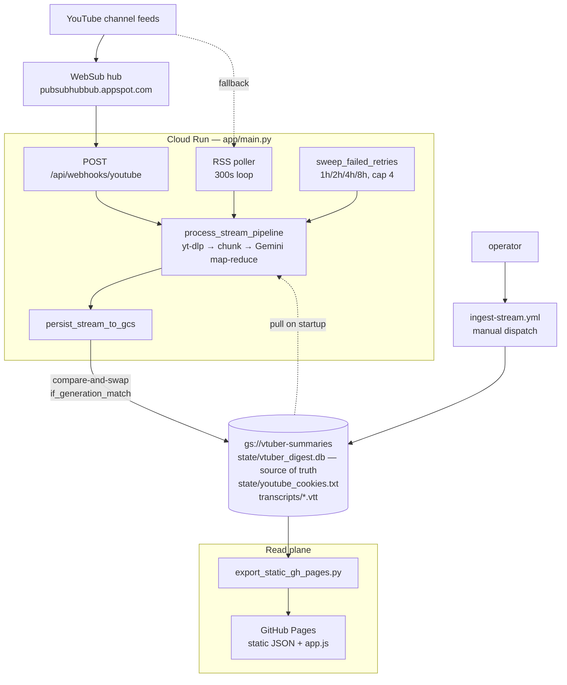
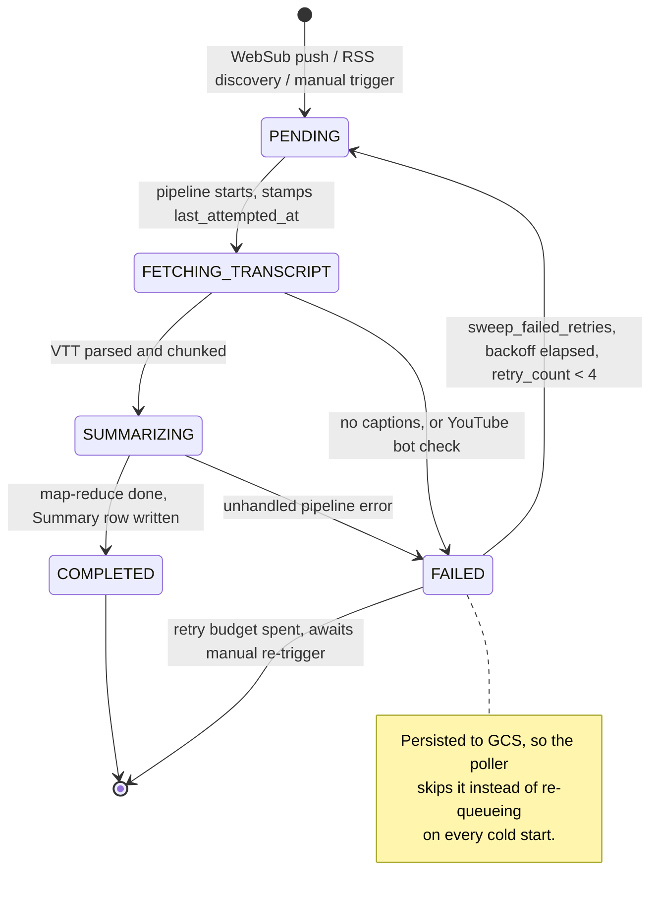
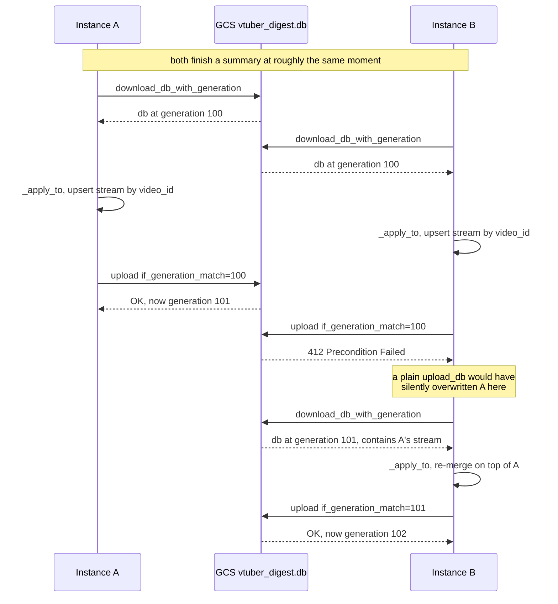

# VTuber Digest — System Design

How the summarization pipeline actually works, end to end: what triggers ingestion, how a
transcript becomes a summary, where state lives, and how it reaches the public site.

Status as of 2026-08-15. Sections marked **⚠ Broken** describe the system as it currently
runs, not as it was designed to run.

---

## 1. What it does

Given a YouTube VTuber stream, produce a structured summary — a TL;DR, a set of standout
stories, and a chronological timeline — with clickable `[HH:MM:SS]` timestamps that seek
into the VOD. Summaries are published as a static, read-only gallery.

The core problem is length: a zatsudan stream runs 2–5 hours, well past what fits in one
useful prompt. The system solves this with **map-reduce over 15-minute transcript chunks**.

---

## 2. Architecture at a glance

Two planes that meet at one file in GCS.



**Everything durable lives in GCS.** Cloud Run's local SQLite file is scratch space that
dies on scale-to-zero; the GitHub Actions runner's copy is scratch space that dies with the
job. Neither is authoritative.

---

## 3. Data model

Four SQLModel tables in one SQLite file (`app/models.py`).

| Table | Key fields | Notes |
|---|---|---|
| `VTuber` | `channel_id` (unique) | 10 tracked channels, seeded on startup |
| `Stream` | `video_id` (unique), `status`, `stream_category`, `published_at` | one row per VOD |
| `Summary` | `stream_id` (unique FK) | `*_json` columns hold JSON as text |
| `UserSettings` | singleton `id=1` | Discord webhook + muted agencies |

`Stream.status` is a `JobStatus` enum: `PENDING → FETCHING_TRANSCRIPT → SUMMARIZING →
COMPLETED`, or `FAILED` from any point.

**Natural keys matter here.** `video_id` and `channel_id` are the real identities.
Autoincrement `id`s are assigned per-database and *will* disagree between the Cloud Run copy
and the GCS copy — §6 depends on this.

---

## 4. Ingestion — three paths in

### 4a. WebSub push (the intended primary path)

On every startup, `main.py:139` subscribes all 10 channels to Google's PubSubHubbub hub,
pointing `hub.callback` at the Cloud Run URL. The hub verifies with a GET carrying
`hub.challenge`, which `main.py:284` echoes back. Leases last `432000s` (5 days) and are
renewed by the next cold start.

YouTube then POSTs an Atom feed to `/api/webhooks/youtube` whenever a tracked channel's feed
changes. The handler parses it, creates a `PENDING` row for any unseen `video_id`, and fires
`process_stream_pipeline` as a FastAPI background task.

**This works today.** Subscriptions verify, pushes arrive, rows get queued.

> **Non-obvious:** `parse_youtube_atom_feed` (`ingestion.py:54`) drops any entry failing
> `is_strict_chatting_stream()` — a title-keyword filter. Most pushes are therefore
> discarded before reaching the DB. That's why push volume is high but queued-stream volume
> is near zero. See §9 for why this is inconsistent with the rest of the system.

### 4b. RSS polling (fallback)

`background_rss_poller` (`main.py:66`) loops every 300s over all channels, fetching
`youtube.com/feeds/videos.xml`. Same parser, so the same title filter applies.

> The docstring says "every 30 minutes"; the actual sleep is 300s (5 minutes). The code is
> the truth.

**It is a discovery backstop, not a completion backstop** — an important distinction. Both
the poller (`main.py:77`) and the webhook handler (`main.py:299`) gate on `if not existing:`,
which matches on **any** status. So the poller only ever picks up videos with *no row at
all*. A row that exists but has no finished work is skipped forever:

| State | How it gets there | Recovered how? |
|---|---|---|
| `PENDING` orphan | instance reclaimed mid-map-reduce | **Poller, incidentally** — `PENDING` is never persisted to GCS, so it dies with the instance and is rediscovered |
| `FAILED` | terminal failure (e.g. bot-blocked captions) | **Bounded retry sweep** — see below |
| `FETCHING_TRANSCRIPT` / `SUMMARIZING` stuck | crash mid-status | **Poller, incidentally** — same reason as `PENDING` |

### 4b-i. The bounded retry sweep

`sweep_failed_retries()` runs at the end of each poll tick and re-queues `FAILED` streams
whose backoff has elapsed: `RETRY_BASE_MINUTES * 2**retry_count`, i.e. 1h → 2h → 4h → 8h,
capped at `MAX_INGEST_RETRIES = 4`. Past the cap the row is left for a human.

The backoff is deliberately slow. The failure this most often encounters is a YouTube bot
check, and retrying it aggressively is what *causes* the block (§9). This sweep exists
precisely to replace the accidental retry loop that got the Cloud Run egress IP flagged.

Two details that are load-bearing:

- **`retry_count` and `last_attempted_at` round-trip through GCS** (they're in
  `_STREAM_FIELDS`). If retry state lived only in the ephemeral container, backoff would
  reset on every cold start and the hammering would resume immediately.
- **The claim is persisted before the work starts.** The sweep bumps `retry_count`, stamps
  `last_attempted_at`, and pushes to GCS *before* launching the pipeline, so a second
  instance sweeping concurrently sees the new backoff window and skips the row rather than
  duplicating a map-reduce run.

A manual re-trigger (`POST /api/streams/trigger`, `main.py:337`) resets `retry_count` to 0 —
so after fixing an environmental cause like expired cookies, a row that exhausted its budget
gets a fresh one. The UI's "Retry Summarizing" button just prefills that modal, and it's
hidden on the static host, so it's a local-dev / Cloud Run affordance only.

Two further sharp edges in this code:

- **Insert race.** Both paths are select-then-insert with no lock, and `video_id` is unique.
  A push and a poll tick interleaving on the same new video raises `IntegrityError` — and
  the poller's `except` (`main.py:93`) wraps the *whole* cycle, so one collision aborts
  polling for every remaining VTuber until the next tick.
- **Dedup is per-instance.** The `existing` check reads the instance-local DB, not GCS, and
  every instance runs its own poller. At `maxScale: 20`, N instances can each discover the
  same video and each run a full map-reduce. §6 makes the resulting writes safe; it does not
  dedupe the work. Currently masked by low traffic keeping the service at 0–1 instances.

### 4c. Batch ingest (what actually built the gallery)

`scratch/ingest_single_stream.py`, run via the `ingest-stream` GitHub Action or locally.
Takes an explicit `--url`, so it **bypasses the title filter entirely**. All 54 streams
currently in the gallery arrived this way.

The workflow does: pull DB from GCS → ingest one stream → push DB back → re-export → deploy
Pages. Its DB push is an unconditional overwrite, which is safe only because it's a single
serialized writer.

---

## 5. The summarization pipeline

`process_stream_pipeline(stream_id)` in `main.py:161`. Five steps, with the stream's
`status` advanced at each boundary so the UI can show progress.



Only `COMPLETED` and `FAILED` are written back to GCS (§6) — the intermediate states live
and die with the container, which is what lets an orphaned `PENDING` be rediscovered.

**1. Fetch transcript** — `download_youtube_subtitles()` shells out to `yt-dlp` twice: once
for metadata (title, duration, `release_timestamp`), once for VTT auto-captions. Both calls
attach a browser User-Agent and, if available, a cookies file. Missing captions is a
terminal `FAILED`.

**2. Persist raw transcript** — uploaded to `gs://vtuber-summaries/transcripts/<video_id>.vtt`
so a re-summarize never needs to re-scrape YouTube.

**3. Parse and chunk** — `parse_vtt()` → `Cue` objects; `chunk_cues(interval_minutes=15)`
groups them into 15-minute buckets.

**4. Map-reduce** (`summarizer.py`) — the heart of it.

*Map:* every chunk is summarized concurrently via `asyncio.gather`. Each prompt is prefixed
with `VTUBER_GLOSSARY_PROMPT` and its text pre-normalized by `normalize_vtuber_transcript_text()`,
which repairs auto-caption manglings of VTuber names (`Crony` → `Kronii`). Chunk text is
truncated to 8000 chars. Response is schema-constrained to `MapChunkResponse`.

*Reduce:* all chunk summaries are fed as JSON into one synthesis call returning
`MasterSummaryResponse` — `stream_category`, `quick_highlights_tldr`, `standout_stories`,
`timeline_breakdown`.

Three design choices worth preserving:

- **Structured output, not freeform.** Both phases pass a Pydantic `response_schema` with
  `response_mime_type="application/json"`, so the model cannot return prose that breaks
  downstream parsing.
- **Markdown is built in code, not by the LLM.** `build_standardized_markdown()` renders the
  validated Pydantic object deterministically. The LLM never controls document structure —
  it only supplies fields. This is what makes timestamp links reliably parseable.
- **Both phases degrade instead of failing.** A failed map call yields a stub chunk summary;
  a failed reduce falls back to concatenating chunk summaries and to
  `infer_stream_category_from_title()`. One bad API call costs quality, not the whole run.

Model is `gemini-2.5-flash` via Vertex AI (ADC required — `vertexai=True` won't accept a bare
env var), or the public API if `GEMINI_API_KEY` is set.

**5. Store and notify** — writes the `Summary` row, sets `COMPLETED`, then dispatches a
Discord embed if enabled and the VTuber's agency isn't muted. A stream that produced zero
highlights gets a non-blocking `warning_message` rather than a failure.

---

## 6. Persistence — why it's a compare-and-swap

This is the least obvious part of the system and the easiest to break.

**The constraint:** Cloud Run runs up to 20 instances (`maxScale: 20`), each with its own
ephemeral SQLite file, and the shared state is a *single opaque blob* in GCS. A whole-file
upload is a read-modify-write. Two instances that both read generation `N` and both upload
would leave only the second one's work — the first summary vanishes silently, having cost a
full map-reduce run.

**The fix** (`app/persistence.py`): a writer never uploads its own database. It merges its
one stream into a fresh copy of the authoritative remote DB, and commits with a
precondition.

```
persist_stream_to_gcs(stream_id):
    payload = snapshot_stream(stream_id)        # detached dict, local session closed
    for attempt in 1..5:
        tmp, generation = download_db_with_generation()   # authoritative copy + its version
        _apply_to(tmp, payload)                           # upsert by video_id
        if upload_db_if_unchanged(tmp, generation):       # if_generation_match
            return True
        # 412 → someone else committed; loop re-reads and re-merges on top
```

The race it defends against, and what the precondition buys:



Three invariants:

1. **The local DB is never authoritative.** It's a working copy. The merge target is always
   freshly downloaded.
2. **Rows are matched on natural keys.** `_apply_to` upserts `Stream` by `video_id` and
   resolves `VTuber` by `channel_id`, letting the remote DB assign its own `id`s. Copying
   `id`s across databases would overwrite unrelated rows — a local stream at `id=1` and a
   remote stream at `id=1` are different streams.
3. **NOT NULL columns are only overwritten when present.** A partially-populated snapshot
   would otherwise raise on flush and discard a good summary. Nullable columns are always
   copied, so a successful retry clears a stale `error_message`.

Startup does the mirror operation: `restore_db_from_gcs()` seeds the container's file before
`init_db()`, so an instance begins with accumulated history rather than an empty gallery.

> **Do not add a plain `upload_db()` call to the runtime path.** It's retained for the
> single-writer CI/batch path and is a last-writer-wins overwrite. In the multi-instance
> runtime it silently drops concurrent work. Covered by `tests/test_persistence.py`.

---

## 7. Publishing

`scratch/export_static_gh_pages.py` reads the DB and writes `dist/`:

- `api/streams.json` — the full list, one object per stream
- `api/streams/<id>.json` — per-stream detail including the parsed summary
- `api/vtubers.json`
- `index.html` + `static/app.js`

`app.js` is served as `./static/app.js?v=<sha256[:12]>` — a **content hash**, not a
timestamp — substituted into the `__CACHE_VERSION__` placeholder by both the exporter and
`read_root()`. A changed bundle is always refetched; an unchanged one stays cached.

`deploy-pages.yml` runs on push to `main` and on manual dispatch: pull DB → export → deploy
via `actions/deploy-pages@v4`. Both Pages workflows share the `pages` concurrency group so
they can't publish over each other. Pages source is the **GitHub Actions artifact flow** —
do not reintroduce a `gh-pages` branch.

If `GCP_VERTEX_SA_KEY` is unset the GCS steps skip and the site deploys empty rather than
hard-failing.

## 8. Frontend runtime routing

One `index.html`/`app.js` runs both locally and on Pages, branching on hostname:

- `isStaticHost` (github.io / `file:`) — reads point at `./api/*.json`, and `#headerActions`
  (Summarize / Settings) is **hidden**, because a static host can only serve GET/HEAD. POSTing
  to the static origin returns 405; hiding the actions plus the content-hash bundle is what
  prevents stale cached JS from attempting it.
- Local dev — talks to the FastAPI server directly and the live actions are available.

---

## 9. Current state and known problems

### ⚠ Broken: transcript fetch on Cloud Run

Every WebSub-triggered stream fails with `"No auto-captions or subtitles available yet."`
**That message is a misdiagnosis.** The actual yt-dlp stderr in the Cloud Run logs is:

```
Sign in to confirm you're not a bot. Use --cookies-from-browser or --cookies
```

It hits both the metadata and subtitle calls, which is why failed rows also show
`duration_seconds = 0`. Worth fixing the reporting to distinguish "captions genuinely
absent" from "extraction refused" — they need completely different responses.

**Egress reputation, measured (2026-08-16).** Which network the request leaves from is the
whole ballgame. Don't re-derive this:

| Egress path | Result | Basis |
|---|---|---|
| Cloud Run default | **Blocked** | ≥1000 bot-check errors in 30d |
| GitHub Actions runner | **Blocked** | 5/5 VODs, stock config, no cookies |
| GCP Cloud Build | **Passed**, no cookies | single run — reliability unverified |
| Local / residential | **Passed** | how all 54 gallery streams were actually ingested |

So this is *not* a blanket datacenter block, and it is *not* a bad `player_client` — from
Cloud Build the stock `player_client=android,web` pulled captions fine with no credentials.
Both free automated paths are blocked, which is why the project runs on cookies
(`state/youtube_cookies.txt`, refreshed via `scratch/db_sync.py push-cookies`).

**Why the IP got flagged.** Before §4b-i's retry sweep existed, the ephemeral DB meant every
cold start began empty, so the RSS poller rediscovered the same ~5 videos and re-queued them
all. Over 30 days: 84 cold starts, 365 rediscoveries, ≥1000 blocked requests — for a handful
of VODs, with no backoff and no memory of having already failed.

That loop is the root cause, and §6 + §4b-i are the fix: failures now persist, so the poller
skips them, and retries are capped and backed off. **Any replacement egress IP will be
burned the same way if that loop is ever reintroduced** — a fresh Cloud NAT address would
last weeks at that request rate. Fix the loop before buying a new IP.

### ⚠ Durability gap: mid-run instance termination

Map-reduce takes minutes and runs in a FastAPI `BackgroundTask` — i.e. *after* the response
is sent. Cloud Run can reclaim an idle instance mid-run, and the write-back only happens at
the end, so the work is lost. `cpu-throttling: false` is already set, which helps.
`minScale: 1` would close it properly, at the cost of an always-on instance.

### ⚠ Inconsistency: the chatting-only filter

`is_strict_chatting_stream` gates both automated paths, but **32 of 54 streams in the
gallery are categorized `gaming`** — they entered via the unfiltered batch path. Meanwhile
the reduce phase has a first-class `stream_category` classifier and the UI has Gaming/Chatting
filter chips.

So the system classifies gaming streams, displays gaming streams, and mostly *contains*
gaming streams — while its automated ingest refuses to admit them. The keyword lists are also
duplicated and divergent between `ingestion.py` (`STRICT_*_KEYWORDS`) and `summarizer.py`
(`infer_stream_category_from_title`).

Resolving this means picking one: ingest everything and let the LLM categorize (consistent
with the roadmap), or keep the gallery chatting-only and stop backfilling gaming VODs.

### Data quality: `published_at`

All 54 currently-published streams carry row-creation timestamps, not broadcast dates — they
share a single date with microsecond precision. The transcriber computes the real
`release_timestamp`, and both ingest paths now apply it, but the existing rows still need a
backfill (`scratch/fix_dates_fast.py`) pushed to GCS.

---

## 10. Roadmap

**Games vs. chatting separation** — resolve §9's inconsistency; combine title analysis
(bracket-tagged game names like `【Minecraft】`) with LLM categorization.

**Roadmap B: real hosted DB** — replace SQLite-in-GCS with Cloud SQL or Firestore and
re-enable live on-demand summarization. That removes the need for §6's compare-and-swap
entirely: row-level writes to a real database don't have the whole-file read-modify-write
problem. §6 is the correct design *given* a single opaque blob, not a design worth keeping
once that constraint is gone.
